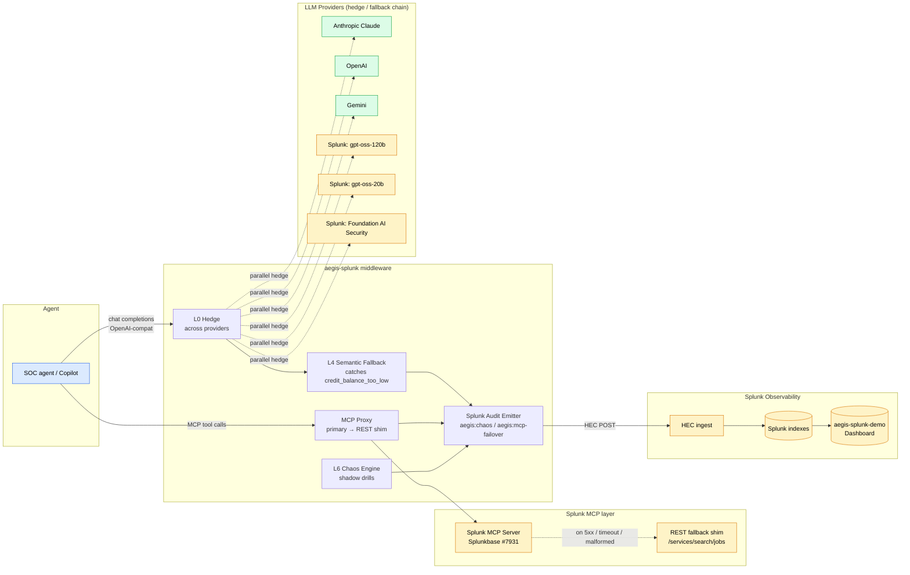

# Architecture

aegis-splunk sits between an agent and the providers/MCP servers it depends on, and turns provider/MCP failures into Splunk-observable recovery.

## System overview



Yellow nodes are Splunk-native surfaces (MCP server, hosted models, HEC, dashboard). Blue is the agent. Green are external LLM providers in the hedge/fallback chain.

## Request flow (happy path)

1. **Agent** issues an OpenAI-compatible `chat.completions` request to aegis-splunk's `/v1` endpoint.
2. **L0 Hedge** fires a second request to a configured backup provider when TTFT exceeds the configured p95 threshold. Whichever returns first wins; the loser is canceled.
3. **L4 Semantic Fallback** inspects errors the gateway didn't catch (e.g. `400 credit_balance_too_low`) and reclassifies them as fallback-eligible.
4. The agent's tool calls travel through the **MCP Proxy** to the official Splunk MCP Server.
5. Each step's outcome is recorded in the **Aegis Receipt** (JSON envelope returned alongside the response).

## Request flow (failure → recovery)

1. Primary provider (Anthropic) returns `429` or `400 credit_balance_too_low`.
2. L0 hedge has already fired to a backup (e.g. **Splunk-hosted `gpt-oss-120b`**) when the primary slowed. The Splunk-hosted response wins.
3. Splunk MCP Server returns `503` on the next tool call. MCP Proxy classifies the outcome and switches to the **REST fallback shim**, which talks directly to `/services/search/jobs` on the same Splunk instance with the cached session token.
4. The **Splunk Audit Emitter** posts a structured event to HEC with `sourcetype=aegis:mcp-failover` (and `aegis:chaos` for chaos engine drills). The SOC analyst sees the failover land in the same Splunk index they were already watching.

## Splunk-specific integration surface

| Splunk component | aegis-splunk module | Role |
|---|---|---|
| **Splunk MCP Server** (Splunkbase #7931) | `src/mcp/splunk-proxy.ts` | Primary MCP target; proxied so failures become observable + recoverable |
| **Splunk hosted models** (gpt-oss-120b, gpt-oss-20b, Foundation AI Security) | `src/aegis/splunk-client.ts`, wired in `l0-hedge.ts` via `hedgeVia: 'splunk'` | First-class providers in the hedge/fallback chain |
| **Splunk HEC** (`SPLUNK_HEC_URL` + token) | `src/aegis/splunk-audit.ts` | Best-effort ingest of `aegis:chaos` and `aegis:mcp-failover` events; errors swallowed so audit pipeline never takes down the request path |
| **Splunk search REST** (`/services/search/jobs?exec_mode=oneshot`) | `src/mcp/splunk-proxy.ts` REST shim | Fallback for `splunk_search` tool when the MCP server is unavailable |
| **Splunk dashboard** (`aegis-splunk-demo`) | `demo/seed-data/` + dashboard XML | Visualizes hedge wins, MCP failovers, MTTR; consumed by the SOC analyst during the demo |

## File layout (Splunk-specific)

```
aegis-splunk/
├── ARCHITECTURE.md                         ← this file
├── README.md
├── src/
│   ├── aegis/
│   │   ├── splunk-client.ts                ← Splunk hosted-models provider
│   │   ├── splunk-audit.ts                 ← HEC emitter
│   │   ├── l0-hedge.ts                     ← extended with hedgeVia: 'splunk'
│   │   ├── (existing layers L1-L6, tf-client, direct-client, types, receipt builder)
│   └── mcp/
│       ├── splunk-proxy.ts                 ← MCP proxy + REST fallback shim
│       └── (existing classifier, hedge, mock-caller, types)
├── demo/
│   ├── SCENARIO.md                         ← 7-beat 3-min video screenplay
│   ├── chaos-script.ts                     ← scripted SOC-P1 outage cascade
│   ├── agent-client.ts                     ← OpenAI-SDK + MCP agent client
│   ├── run-demo.sh                         ← single-command demo orchestrator
│   ├── seed-data/
│   │   └── splunk-failed-logins.csv        ← credential-stuffing pattern seed
│   └── README.md                           ← operator setup + recording guide
├── docs/
│   ├── ARCHITECTURE.md                     ← detailed 7-layer specification
│   ├── SPLUNK_PROVIDER_NOTES.md            ← per-phase implementation notes + TODOs
│   ├── RECEIPT.md                          ← JSON envelope schema
│   ├── DEMO-SCRIPT.md                      ← extended demo screenplay
│   ├── SUBMISSION.md                       ← Splunk Agentic Ops submission notes
│   └── SUBMIT-CHECKLIST.md                 ← pre-submit verification list
└── tests/                                  ← 68 passing tests (Bun)
```

The detailed per-layer specification (L0–L6 invariants, monitors, degraded behaviors, MCP READ_HEDGE vs WRITE_TIED classification) lives in [docs/ARCHITECTURE.md](./docs/ARCHITECTURE.md). The Receipt JSON schema is in [docs/RECEIPT.md](./docs/RECEIPT.md).

## How aegis-splunk satisfies the four Splunk Agentic Ops judging criteria

- **Technological Implementation.** 13 TypeScript modules, 68 passing tests, `bun run demo/run-demo.sh` is the single-command reproducer; the hedge layer, MCP proxy + REST shim, and HEC audit emitter compose end-to-end and can be exercised on a local Splunk Enterprise trial.
- **Design.** Drop-in OpenAI-SDK-compatible base URL means an existing agent does not need to be rewritten to gain resilience. The dashboard makes hedge wins and MCP failovers visible in the same Splunk index the SOC analyst is already watching.
- **Potential Impact.** Every major LLM provider has had a multi-hour outage in the past 12 months. Agentic AI in security operations means an LLM blink during a P1 incident is now a security incident in its own right. aegis-splunk keeps the agent provably alive across the outage and emits the recovery as an observable Splunk event.
- **Quality of the Idea.** The chaos-verification trace IS the Splunk observability artifact — not a side channel. The SOC team learns one tool, not two. Hedge + fallback + chaos primitives are SRE patterns (Jeff Dean's "Tail at Scale", Netflix Simian Army) imported into the agentic LLM stack via a Splunk-native surface.
